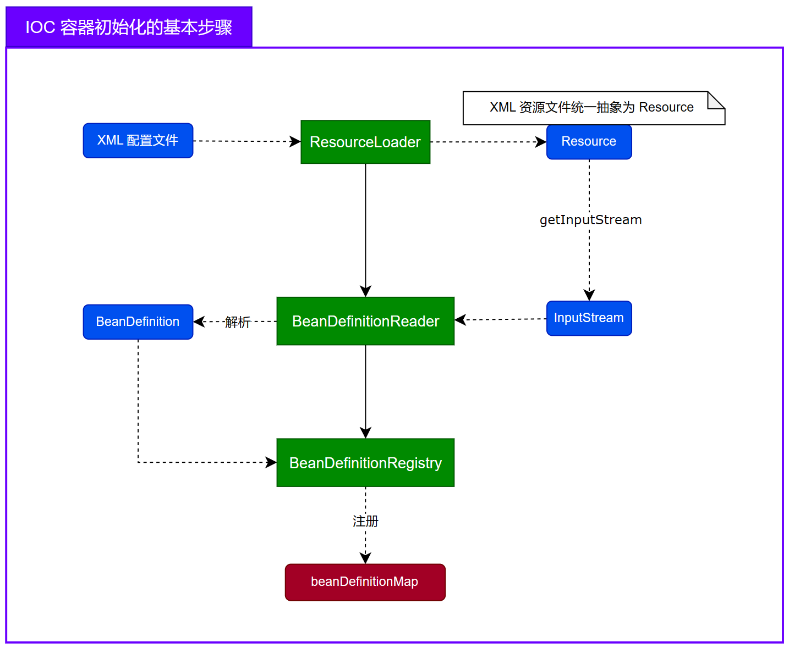

# 知识点总结

## Bean和组件的关系：
spring中的Bean通常都是无状态，就相当于是一个组件，其作用就是实现某个功能的。*IOC容器* 得以实现的基础是 *应用上下文 ApplicationContext* 通过资源加载器加载配置的资源文件，预先将bean进行了Bean定义注册(组件注册)。


## 资源加载器的功能：

1. 加载 XML 配置文件
2. 解析 XML 文件，提取 `<bean>` 标签
3. 注册 Bean 的配置信息：将 `<bean>` 标签的配置信息通过一个 `BeanDefinition` 表示（用于封装 Bean 的配置信息），并注册到 `DefaultListableBeanFactory` 的Map集合中 
> BeanDefinition：用于描述一个 *Bean* 本身，*BeanDefinition* 包括了 *Bean* 的各种配置信息及元数据，如 *Bean* 的 *Class 对象*，*Bean* 的属性注入信息，*Bean* 的作用域（是否为单例），配置的初始化和销毁方法，是否懒加载等


## Aop的实现方式：

1. 基于接口的JDK动态代理
2. 基于类的CGLIB代理


## 切入点表达式功能上分为两部分：

> 🥕 切入点表达式定义了哪些类和方法需要被拦截。
1. <span style="color: red;"><strong>类匹配：</strong></span> 应用程序获取某个 *Bean* 时，先与预先配置的切入点表达式进行类匹配的检查，如果类匹配通过，就需要创建 *AOP* 代理对象。
2. <span style="color: red;"><strong>方法匹配：</strong></span> 通过 *AOP* 代理对象进行方法调用时，会将方法调用委托给 `InvocationHandler` 中的 `invoke` 方法，接着通过切入点表达式进行具体的方法匹配，如果方法匹配通过就需要将方法调用委托给相应的 *拦截器*，由拦截器负责调用 *通知逻辑* 和 *原方法逻辑*。


## IOC 容器初始化：

### IOC 容器初始化包括：

1. 将 XML 格式的 Bean 定义配置文件加载并解析为 BeanDefinition。
2. 将 BeanDefiniton 保存（注册）到 beanDefinitionMap 中。

> beanDefinitionMap 本质上是一个 `ConcurrentHashMap<String, BeanDefinition>`

### IOC 容器初始化流程图：




## 匿名内部类：

``` Java
public class OuterClass {

    private String message = "Hello from OuterClass!";

    // 封闭类的实例方法，带有参数
    public void outerMethod(String name, Object value) {
        System.out.println("This is a method in OuterClass. Message: " + message + ", Name: " + name + ", Value: " + value);
    }

    // 定义一个方法，包含匿名内部类
    public void createAnonymousClass(String name, Object value) {
        // 匿名内部类
        Runnable runnable = new Runnable() {
            @Override
            public void run() {
                // 调用封闭类的实例方法，并传递参数
                outerMethod(name, value);
            }
        };

        // 启动线程，执行匿名内部类的run方法
        new Thread(runnable).start();
    }

    public static void main(String[] args) {
        OuterClass outer = new OuterClass();
        outer.createAnonymousClass("TestName", 123);
    }
}
```

编译后，再反编译得到的匿名内部类的 *Java* 代码：

```java
public class OuterClass$1 implements Runnable {
    final OuterClass this$0;
    final String val$name;
    final Object val$value;

    OuterClass$1(OuterClass outerClass, String name, Object value) {
        this.this$0 = outerClass;
        this.val$name = name;
        this.val$value = value;
    }

    @Override
    public void run() {
        this.this$0.outerMethod(this.val$name, this.val$value);
    }
}
```


## 单例 Bean 内部依赖于原型作用域的 Bean：

### 示例说明：

#### 配置文件（beans.xml）

```xml
<beans xmlns="http://www.springframework.org/schema/beans"
       xmlns:xsi="http://www.w3.org/2001/XMLSchema-instance"
       xsi:schemaLocation="http://www.springframework.org/schema/beans
       http://www.springframework.org/schema/beans/spring-beans.xsd">

    <!-- 定义一个原型作用域的Bean -->
    <bean id="prototypeBean" class="com.example.PrototypeBean" scope="prototype"/>
    
    <!-- 定义一个单例Bean，注入原型Bean -->
    <bean id="singletonBean" class="com.example.SingletonBean">
        <property name="prototypeBean" ref="prototypeBean"/>
    </bean>
</beans>
```

#### Java类定义

##### PrototypeBean.java

```Java
public class PrototypeBean {
    public PrototypeBean() {
        System.out.println("PrototypeBean instance created: " + this);
    }

    public void doSomething() {
        System.out.println("Doing something in PrototypeBean: " + this);
    }
}
```

##### SingletonBean.java

```java
public class SingletonBean {
    private PrototypeBean prototypeBean;

    public void setPrototypeBean(PrototypeBean prototypeBean) {
        this.prototypeBean = prototypeBean;
    }

    public void doSomething() {
        System.out.println("SingletonBean is doing something.");
        prototypeBean.doSomething();
    }
}
```

##### MainApp.java

```Java
import org.springframework.context.ApplicationContext;
import org.springframework.context.support.ClassPathXmlApplicationContext;

public class MainApp {
    public static void main(String[] args) {
        ApplicationContext context = new ClassPathXmlApplicationContext("beans.xml");

        SingletonBean singletonBean1 = (SingletonBean) context.getBean("singletonBean");
        singletonBean1.doSomething();

        SingletonBean singletonBean2 = (SingletonBean) context.getBean("singletonBean");
        singletonBean2.doSomething();

        // 检查SingletonBean的实例是否相同
        System.out.println("SingletonBean instances are the same: " + (singletonBean1 == singletonBean2));
    }
}
```

### 预期输出

```shell
PrototypeBean instance created: com.example.PrototypeBean@1d251891
SingletonBean is doing something.
Doing something in PrototypeBean: com.example.PrototypeBean@1d251891
PrototypeBean instance created: com.example.PrototypeBean@6d6f6e28
SingletonBean is doing something.
Doing something in PrototypeBean: com.example.PrototypeBean@6d6f6e28
SingletonBean instances are the same: true
```

### 结论总结：

- 尽管 `singletonBean1` 和 `singletonBean2` 是同一个实例（单例 *Bean*），但 `prototypeBean` 是不同的实例（原型 *Bean*），因为每次注入 `prototypeBean` 都会创建一个新的实例。
- `singletonBean1 == singletonBean2` 返回 `true`，表示 `SingletonBean` 是单例的，单例 *Bean* 的实例在整个容器中是唯一的。
- 如果单例 *Bean* 内部依赖于原型作用域的 *Bean*，每次获取该单例 *Bean* 时，其内部的原型 *Bean* 实例都会被重新注入一个新的对象。也就是说，每次调用单例 *Bean* 的方法时，原型 *Bean* 都会是一个新的实例。


## 构造器注入、Setter注入、字段注入如何解决循环依赖？

从解决循环依赖的问题来看，*构造器注入* 和 *Setter 注入/字段注入* 可以被视作不同的类别。

### 1. **构造器注入**

**构造器注入** 依赖于构造函数参数来注入依赖。在 Bean 的创建过程中，Spring 需要在构造函数调用时就提供所有依赖。如果出现循环依赖，Spring 无法完成构造函数的调用，因此会导致创建失败。

- 循环依赖问题：
  - 构造器注入无法处理循环依赖，因为所有依赖项必须在构造函数调用之前准备好。如果 `BeanA` 依赖 `BeanB`，而 `BeanB` 又依赖 `BeanA`，Spring 会在尝试创建 `BeanA` 时遇到 `BeanB` 还未创建的情况，反之亦然。
- 解决方式：
  - **报错**：构造器注入要求所有依赖在 Bean 实例化时即需提供，Spring 会在启动时检测到这种循环依赖问题并抛出 `BeanCurrentlyInCreationException` 异常。

### 2. **Setter 注入和字段注入**

**Setter 注入** 和 **字段注入** 都发生在 Bean 实例化之后的初始化阶段。它们依赖于 Spring 的三级缓存机制来处理循环依赖。

- **<span style = "color: red;">三级缓存机制 </span>**：
  - **一级缓存**：单例对象缓存池，已经实例化并且属性赋值，这里的对象是**成熟对象**；
  - **二级缓存**：单例对象缓存池，已经实例化但尚未属性赋值，这里的对象是**早期对象/半成品对象**；
  - **三级缓存**（待创建的 Bean）：单例工厂的缓存...<span style = "color: blue;">（后续进行补充）</span>。
- **处理循环依赖**：
  - **Setter 注入** 和 **字段注入** 的依赖项在 Bean 实例化之后被注入，这使得 Spring 可以在 Bean 实例化过程中解决部分循环依赖问题。由于依赖注入发生在实例化之后，Spring 可以利用缓存中提前暴露的 Bean 实例来完成注入，从而绕过构造器注入带来的限制。

### 结论

- **构造器注入**：
  - **无法处理** 循环依赖问题，因为构造器注入需要所有依赖在 Bean 实例化时就已提供。Spring 在创建 Bean 时会立即检测到循环依赖并抛出异常。
- **Setter 注入和字段注入**：
  - **可以处理** 循环依赖问题，因为它们的依赖注入发生在 Bean 实例化之后。Spring 可以利用三级缓存机制解决循环依赖问题，允许 Bean 在实例化时相互引用。

因此，从解决循环依赖的角度来看，构造器注入属于一类，而 Setter 注入和字段注入属于另一类。构造器注入在遇到循环依赖时会直接抛出异常，而 Setter 注入和字段注入通过三级缓存机制可以在实例化之后处理循环依赖。


## 依赖注入导致的循环依赖问题：

循环依赖产生的原因：就是 Spring 提供的依赖注入功能导致的，如果 `BeanA` 依赖 `BeanB`，而 `BeanB` 又依赖 `BeanA`，那么创建 `BeanA` 时会递归创建 `BeanB`，而在创建 `BeanB` 时又会递归创建 `BeanA`，这样就导致了无限递归，最终抛出 `StackOverFlow` 栈内存溢出错误。

Spring 解决循环依赖问题的核心是三级缓存。将 Bean 的 **实例化** 和 **依赖注入** 两步操作分离开来，并通过三级缓存将实例化后的 Bean 提前暴露从而解决循环依赖。

```Java
addSingletonFactory(beanName, new ObjectFactory<Object>() {
    			@Override
                public Object getObject() throws BeansException {
                    return (AbstractAutowireCapableBeanFactory.this).getEarlyBeanReference(beanName, beanDefinition, finalBean);
                }
            });
```

**Spirng 基于缓存解决的循环依赖只针对于单例 Bean，也就是说 Spirng 只能解决单例 Bean 的循环依赖问题，不能解决非单例 Bean 的循环依赖问题。**原因就在于 Spring 解决循环依赖问题靠的是三级缓存，而非单例 Bean 不会放到缓存中提起暴露出来，从而也就无法解决循环依赖。


## 理解 Spring 中 Bean 的生命周期的重要意义：

> 🥑 Spring 只管理单例 Bean 的**完整**生命周期（实例化、初始化、销毁）；对于原型 bean 而言，Spring 只负责其生命周期中实例化、初始化阶段，在创建完成后，Spring 将其交给用户自行管理。

<span style = "color: purple;"> Spring 对于 Bean 的生命周期进行了完整的定义的意义在于，Spring 可以通过在生命周期的各个阶段提供相应的**钩子方法**，来允许开发者在**特定的时间节点**添加**自定义的逻辑**。</span>

> 🍫 对于Spring功能上的扩展（如：AOP）都是基于生命周期中定义的钩子方法来实现，可以说钩子方法是Spring 功能扩展的基础。

钩子方法主要与三个接口相关：

1. `BeanFactoryPostProcessor`：

   **作用**：在 Spring 容器**创建并加载 Bean 定义后**添加自定义逻辑。

   **主要方法**：

   - ``` java
     postProcessBeanFactory(ConfigurableListableBeanFactory beanFactory)
     ```

2. `BeanPostProcessor`：

   **作用**：在 Bean **初始化**阶段添加自定义逻辑。

   **主要方法**：

   - ```java
     postProcessBeforeInitialization(Object bean, String beanName)
     ```

   - ```java
     postProcessAfterInitialization(Object bean, String beanName)
     ```

3. `InitializationAwareBeanPostProcessor`：

   **作用**：在 Bean **实例化**阶段添加自定义逻辑。

   - ```java
     postProcessBeforeInstantiation(Class<?> beanClass, String beanName)
     ```

   - ```java
     postProcessAfterInstantiation(Object bean, String beanName)
     ```

<span style = "color: purple;"> **通过这些钩子方法，Spring 允许开发者在 Bean 生命周期的不同阶段进行扩展和自定义操作，从而提升系统的功能和灵活性。**</span>


 